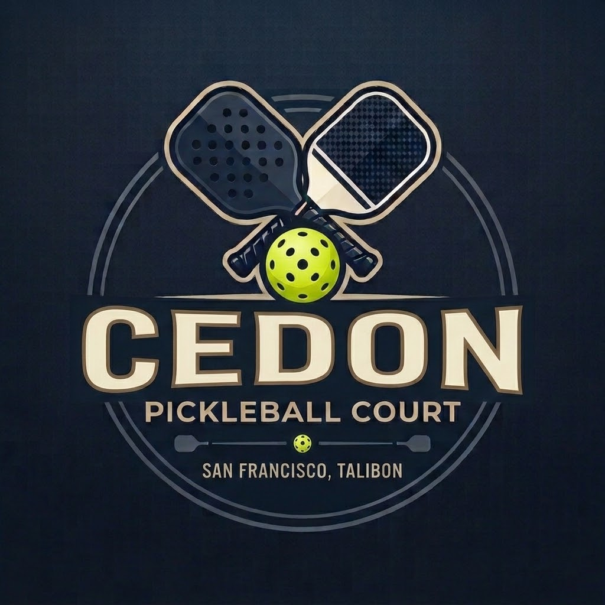

# 🎾 Cedon Pickleball Court - Online Booking System

A modern, mobile-first web application for booking pickleball court slots at **Cedon Pickleball Court** located in P5, San Francisco, Talibon, Bohol.



## 📋 Features

- **Interactive Calendar** – Browse available dates with current month highlighting
- **Real-time Schedule** – View court availability with dynamic time slot generation
- **Smart Time Filtering** – Past time slots are automatically grayed out for today's date
- **Dual Rate System** – Morning session (5AM–7AM) at ₱150/hr, Evening session (4PM–12AM) at ₱200/hr
- **GCash Payment Integration** – Seamless redirect to GCash-hosted payment gateway
- **Google Maps Integration** – One-click GPS button to navigate to the court
- **Responsive Design** – Optimized for mobile devices with dark theme matching the brand
- **Persistent Bookings** – Local storage saves booking state across sessions

## 📁 Files (Flat Structure)

All files are in the root folder — no subdirectories needed:

```
pikol-booking/
├── index.html              # Main booking application
├── gcash-payment.html      # Mock GCash payment gateway page
├── style.css               # Application styles
├── app.js                  # Application logic
├── logo.png                # Cedon Pickleball Court logo
└── README.md               # This file
```

## 🚀 Deployment to GitHub Pages

### Step 1: Upload to GitHub
1. Go to your repository on GitHub
2. Click **Add file → Upload files**
3. Drag and drop **all 6 files** from this folder into the upload area
4. Make sure they all appear in the root (no folders)
5. Scroll down, type commit message: `Update to flat structure`
6. Click **Commit changes**

### Step 2: Enable GitHub Pages
1. In your repo, click **Settings** tab
2. In left sidebar, click **Pages**
3. Under **Build and deployment**:
   - **Source**: Deploy from a branch
   - **Branch**: `main` → `/(root)`
4. Click **Save**
5. Wait 1 minute, refresh
6. Your live URL: `https://raevennepark.github.io/pikol-booking/`

## 💳 Payment Gateway Integration (No API Needed)

This project uses **hosted payment gateways** — no backend server or API keys required.

### How It Works
1. User clicks "Continue to Payment"
2. You choose a payment method:
   - **Hosted Gateway** → Redirect to PayMongo/Xendit checkout URL
   - **GCash QR** → Show your personal GCash QR code for manual scanning

### Recommended Hosted Gateways (Philippines)

| Provider | Setup | How to Use |
|----------|-------|------------|
| **PayMongo** | [dashboard.paymongo.com](https://dashboard.paymongo.com) | Create Payment Link → copy URL → paste in `app.js` |
| **Xendit** | [dashboard.xendit.co](https://dashboard.xendit.co) | Create Payment Request → copy checkout URL → paste in `app.js` |
| **HitPay** | [hitpayapp.com](https://hitpayapp.com) | Create Payment Link → copy URL → paste in `app.js` |

### Setting Up PayMongo (Easiest)

1. Sign up at [PayMongo Dashboard](https://dashboard.paymongo.com)
2. Go to **Payment Links** → **Create Link**
3. Set amount (e.g., ₱200) and description
4. Copy the generated link (looks like: `https://pm.link/g/abc123`)
5. Open `app.js`, find this line:
   ```javascript
   const PAYMENT_LINKS = {
       morning: 'YOUR_PAYMONGO_LINK_HERE',   // ₱150
       evening: 'YOUR_PAYMONGO_LINK_HERE'    // ₱200
   };
   ```
6. Replace with your actual PayMongo links
7. Commit the change

### Setting Up GCash QR Code

1. Open your **GCash app**
2. Tap **Profile** → **QR Code**
3. Screenshot or save your QR code
4. Rename it to `gcash-qr.png`
5. Upload it to your repository root
6. Users can now select "Scan GCash QR Code" and pay directly to you

## ⚙️ Configuration

Edit `app.js` to customize rates and hours:

```javascript
const CONFIG = {
    OPERATING_HOURS: {
        morning: { start: 5, end: 7 },    // 5AM - 7AM
        evening: { start: 16, end: 24 }   // 4PM - 12AM
    },
    RATES: {
        morning: 150,   // Morning rate in PHP
        evening: 200    // Evening rate in PHP
    },
    LOCATION: {
        name: 'P5, San Francisco, Talibon, Bohol',
        coords: '10.160850,124.309307'
    }
};
```

## 🎨 Customization

Edit `style.css` variables to change colors:

```css
:root {
    --accent-gold: #d4a853;        /* Primary brand color */
    --bg-primary: #0a0e1a;         /* Dark background */
    --color-open: #22c55e;         /* Available slot color */
    --color-booked: #ef4444;       /* Booked slot color */
}
```

## 📱 How to Update Your Live Site

1. Edit the file directly on GitHub (click file → pencil icon)
2. OR: Upload the new file to replace the old one
3. GitHub Pages auto-deploys within 1 minute
4. Refresh your live URL to see changes

## 📍 Location

**Cedon Pickleball Court**  
P5, San Francisco, Talibon, Bohol  
[Open in Google Maps](https://www.google.com/maps/search/?api=1&query=10.160850,124.309307)

## 📄 License

Built for Cedon Pickleball Court. Free to use and modify.

---

**Built with ❤️ for the Bohol pickleball community**
